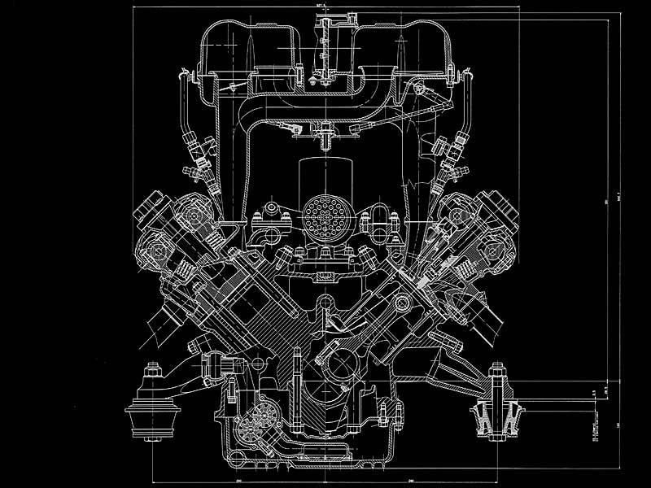

# gear-charts 🌌

Kubernetes deployment charts and instructions. 

### Requirements
1) Docker
2) Kubernetes
3) Helm

### Quickstart

#### Startup:
```
helm package gear-sv --version <semver>
helm upgrade --install gear-sv gear-sv-<semver> --namespace <default>
kubectl get pods -n <namespace>
```

#### Accessing Services: 

Does your cluster have an accessable external IP?

No:
1) `kubectl port-forward services/gearpla -n <namespace> 7070:3010`
2) Navigate to 127.0.0.1:7070 in your browser.

Yes:
1) Navigate to node-external-ip:30010 in your browser


#### Running Query:


